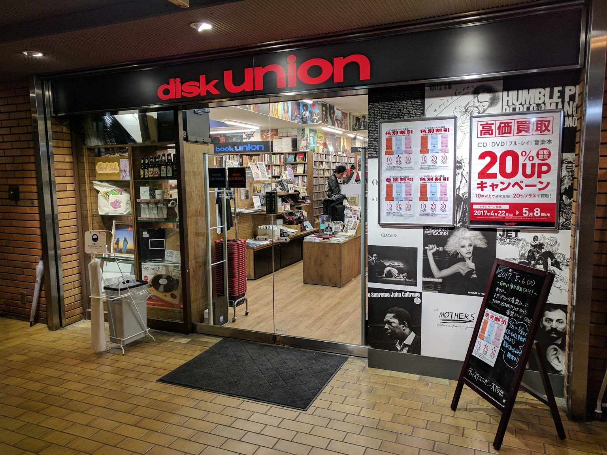

# Japan 2017

## Record Shops

### Tokyo

#### Disk Union (ディスクユニオン)

Name | Hours | Address
---- | ----- | ----- 
[SHINJUKU ROCK RECORD STORE](http://diskunion.net/shop/ct/shinjuku_rockrecord) | 11:00-21:00 (Sunday/Holiday -20:00) | Shimogiku Bldg. 4F/5F, 3-34-12 Shinjuku Shinjuku-ku, Tokyo 160-0022
[SHINJUKU JAPANESE ROCK/INDIES STORE(BF)](http://diskunion.net/shop/ct/shinjuku_jp) |11:00-21:00 (Sunday/Holiday -20:00) | Yamada Bldg. BF, 3-31-4 Shinjuku Shinjuku-ku, Tokyo 160-0022
[SHINJUKU ROCK CD STORE(1F)](http://diskunion.net/shop/ct/shinjuku_rock) | 11:00-21:00 (Sunday/Holiday -20:00) | Yamada Bldg. 1F, 3-31-4 Shinjuku, Shinjuku-ku, Tokyo 160-0022
[SHINJUKU CD・RECORD ACCESSORY STORE(2F)](http://diskunion.net/shop/ct/shinjuku_acc) | 11:00-21:00 (Sunday/Holiday -20:00) | Yamada Bldg. 2F, 3-31-4 Shinjuku, Shinjuku-ku, Tokyo 160-0022
[SHINJUKU PROGRESSIVE ROCK STORE(3F)](http://diskunion.net/shop/ct/shinjuku_progre) | 11:00-21:00 (Sunday/Holiday -20:00) | Yamada Bldg. 3F, 3-31-4 Shinjuku, Shinjuku-ku, Tokyo 160-0022
[SHINJUKU LATIN・BRAZIL STORE(4F)](http://diskunion.net/shop/ct/shinjuku_latin) | 11:00-21:00 (Sunday/Holiday -20:00) | Yamada Bldg. 4F, 3-31-4 Shinjuku, Shinjuku-ku, Tokyo 160-0022
[SHINJUKU USED ROCK CD STORE(5F)](http://diskunion.net/shop/ct/shinjuku_usedrockcd) | 11:00-21:00 (Sunday/Holiday -20:00) | Yamada Bldg. 5F, 3-31-4 Shinjuku, Shinjuku-ku, Tokyo 160-0022
[SHINJUKU INDIE・ALTERNATIVE ROCK STORE(6F)](http://diskunion.net/shop/ct/shinjuku_alternative) | 11:00-21:00 (Sunday/Holiday -20:00) | Yamada Bldg. 6F, 3-31-4 Shinjuku, Shinjuku-ku, Tokyo 160-0022
[SHINJUKU PUNK STORE(7F)](http://diskunion.net/shop/ct/shinjuku_punk) | 11:00-21:00 (Sunday/Holiday -20:00) | Yamada Bldg. 7F, 3-31-4 Shinjuku, Shinjuku-ku, Tokyo 160-0022
[SHINJUKU USED STORE](http://diskunion.net/shop/ct/shinjuku_used) | 11:00-21:00 (Sunday/Holiday -20:00) | Kawase Bldg. 3F, 3-17-5 Shinjuku, Shinjuku-ku, Tokyo 160-0022
[SHINJUKU JAZZ STORE](http://diskunion.net/shop/ct/shinjuku_jazz) | 11:00-21:00 (Sunday/Holiday -20:00) | 3-31-2 Shinjuku, Shinjuku-ku, Tokyo 160-0022
[SHINJUKU CLASSICAL MUSIC STORE](http://diskunion.net/shop/ct/shinjuku_classic) | 11:00-21:00 (Sunday/Holiday -20:00) | Kawase Bldg. 8F, 3-17-5 Shinjuku, Shinjuku-ku, Tokyo 160-0022
[SHINJUKU SOUL/BLUES STORE](http://diskunion.net/shop/ct/shinjuku_soul) | 11:00-21:00 (Sunday/Holiday -20:00) | Fukumoto Bldg. BF, 3-28-2 Shinjuku, Shinjuku-ku, Tokyo 160-0022
[SHINJUKU HIPHOP/DANCE MUSIC STORE](http://diskunion.net/shop/ct/shinjuku_club) | 11:00-21:00 (Sunday/Holiday -20:00) | Fukumoto Bldg. 3F, 3-28-2 Shinjuku, Shinjuku-ku, Tokyo 160-0022
[SHINJUKU HEAVY METAL STORE](http://diskunion.net/shop/ct/shinjuku_metal) | 11:00-21:00 (Sunday/Holiday -20:00) | Mitsumine Bldg. 5F, 3-28-4 Shinjuku, Shinjuku-ku, Tokyo 160-0022
[SHINJUKU CINEMA STORE](http://diskunion.net/shop/ct/shinjuku_movie) | 11:00-21:00 (Sunday/Holiday -20:00) | Mitsumine Bldg. 3F, 3-28-4 Shinjuku, Shinjuku-ku, Tokyo 160-0022
[OCHANOMIZU EKIMAE STORE](http://diskunion.net/shop/ct/ocha_ekimae) | 11:00-21:00 (Sunday/Holiday -20:00) | Shin-Ochanomizu Bldg. 2F, 4-3 Kanda Surugadai, Chiyoda-ku, Tokyo 101-0062
[JazzTOKYO STORE](http://diskunion.net/shop/ct/jazz_tokyo) | 11:00-21:00 (Sunday/Holiday -20:00) | [New Surugadai Bldg. 2F, 2-1-45 Kanda Surugadai, Chiyoda-ku, Tokyo 101-0062](https://www.google.com/maps/place/%E3%83%87%E3%82%A3%E3%82%B9%E3%82%AF%E3%83%A6%E3%83%8B%E3%82%AA%E3%83%B3+%E3%81%8A%E8%8C%B6%E3%81%AE%E6%B0%B4%E3%82%BD%E3%82%A6%E3%83%AB%E3%83%BB%E3%83%AC%E3%82%A2%E3%82%B0%E3%83%AB%E3%83%BC%E3%83%B4%E9%A4%A8/@35.698944,139.762603,15z/data=!4m5!3m4!1s0x0:0x7d19a524bd5f1a23!8m2!3d35.698944!4d139.762603?hl=ja)
[OCHANOMIZU SOUL/RARE GROOVE STORE](http://diskunion.net/shop/ct/ocha_soul) | 11:00-21:00 (Sunday/Holiday -20:00) | New Surugadai Bldg. 2F, 2-1-45 Kanda Surugadai, Chiyoda-ku, Tokyo 101-0062
[OCHANOMIZU HARD ROCK/HEAVY METAL STORE](http://diskunion.net/shop/ct/ocha_metal) | 11:00-21:00 (Sunday/Holiday -20:00) | Akanetubo Bldg., 2-6-10 Kanda Surugadai, Chiyoda-ku, Tokyo 101-0062
[SHIBUYA USED STORE](http://diskunion.net/shop/ct/shibuya_used) | 11:00-21:00 (Sunday/Holiday -20:00) | Antena21 Bldg. 2F/3F, 30-7 Udagawa-cho, Shibuya-ku, Tokyo 150-0042
[SHIBUYA JAZZ/RARE GROOVE STORE](http://diskunion.net/shop/ct/shibuya_jazz) | 11:00-21:00 (Sunday/Holiday -20:00) | Antena21 Bldg. BF, 30-7 Udagawa-cho, Shibuya-ku, Tokyo 150-0042

Name | Area | Genres | Hours | Address | Comments
---- | ----- | ------ | ----- | ------ | -----
[Jazz TOKYO](http://blog-ocha-soul.diskunion.net/) | Ochanomizu, Tokyo | Soul, Rare Groove | 11:00 ~ 21:00 (Sunday/Holiday 20:00) | [〒101-0062 東京都千代田区Kanda Surugadai, 2 Chome, 神田駿河台２丁目１−４５-2F](https://www.google.com/maps/place/Disk+Union/@35.6984038,139.7628927,17z/data=!4m5!3m4!1s0x0:0x7d19a524bd5f1a23!8m2!3d35.698944!4d139.762603?hl=en-US) | [Odigo](https://www.odigo.jp/spots/10954-disk-union-jazz-tokyo-chiyoda-ku) Best Jazz store in Tokyo
[Osaka Store](http://diskunion.net/shop/ct/osaka) | Osaka | All | 11:00 ~ 21:00 (Sunday/Holiday 20:00) | ACTIII Bldg. 1F, 15-17 Douzan-cho Kitaku Osaka-shi, Osaka 530-0027

#### The Rest

Name | Area | Genres | Opening Hours | Address
---- | ---- | ------ | ------------- | -------
[Shame Records](http://www.shamerecords.main.jp) | Shinjuku | R&B, Soul, Funk, Disco, Hip Hop | 15:00 ~ 21:00 | 〒160-0023 東京都新宿区西新宿7-16-15第一歯朶ビル4F-A
[Hal's](http://hals-jazz.com) | Shinjuku | Jazz, Brazil | 12:00 ~ 21:00 | 〒160-0023 東京都新宿区西新宿7丁目10-17 新宿ダイカンプラザ　B館　306号
[The Perfect Circle Beatles](http://www.perfectcirclebeatles.jp) | Shinjuku | Beatles | 12:00 ~ 21:00 | 〒160-0023 東京都新宿区西新宿7-10-17ダイカンプラザB館507
[Coconuts Disk](http://www.coconutsdisk.com) | Yoyogi | All | 12:00 ~ 21:00 | 〒151-0053 渋谷区代々木1-36-6
[East Record](http://www.eastrecord.com) | Chiyoda | Soul, Funk, Disco, Rare Groove, Jazz, World Music | 14:00 ~ 22:00 (Monday Closed) | 〒101-0051 神田神保町1-12シマダビル4F

### Kyoto

### Osaka

Name | Area | Genres | Opening Hours | Address | Comments | Photos
---- | ----- | ------ | ------------- | ------- | ------- | ------
[Music Inn](http://music-inn.jimdo.com) | ? | All | 11:00 ~ 20:00 | [Japan, 〒530-0017 Osaka Prefecture, Osaka, Kita Ward, Kakudacho, 1−10, くろふねビル 2F][music-inn-map] | Recommended by The Vinyl Guide | 
[K-West Records](https://www.facebook.com/K-West-Records-439907216083238/) | ? | ? | 12:00 ~ 21:00 | [Japan, 〒530-0017 Osaka Prefecture, Osaka, 北区角田町１−１０ くろふねビル2F][k-west-map] | Common stuff at good prices. |
[King Kong Umeda]() | Umeda | ? | 11:00 ~ 23:00 | [1 Chome-9-20 Umeda, Kita-ku, Ōsaka-shi, Ōsaka-fu 530-0001, Japan][king-kong-umeda-map] | Small shop, the other King Kong is bigger. | 
[Disc J.J. Umeda](http://www.discjj.com) | Umeda | ? | 11:00 ~ 20:00 | [Japan, 〒530-0001 Osaka Prefecture, Osaka, Kita Ward, Umeda, 1−1−3][disc-jj-umeda-map] | ? | 
[Bamboo Music](http://bamboo-music.net) | Umeda | Jazz, Funk, Soul, Rare Groove | 12:00 ~ 20:00 | [Japan, 〒530-0028 Osaka Prefecture, Osaka, Kita Ward, Banzaicho, 3−41, シロノビル104号室][bamboo-music-map] | ? | 
[Disk Union](http://diskunion.net/shop/ct/osaka) | ? | All | 11:00 ~ 21:00 | [ACTIII Bldg. 1F, 15-17 Douzan-cho Kitaku Osaka-shi, Osaka 530-0027][disk-union-osaka-map] | ? | 
[Disc J.J. Nipponbashi](http://www.discjj.com) | Nipponbashi | Jazz, Soul, Rock | 11:00 ~ 20:00 (Thu/Hol 19:00) | [〒556-0005, 4 Chome-8-11 Nipponbashi, Naniwa Ward, Osaka, Osaka Prefecture, Japan][disc-jj-map] | Stereolab "Dots and Loops" and High Llamas "Lollo Rosso" | 
[Smile Record]() | ? | ? | 11:00 ~ 20:00 | [Japan, 〒530-0026 Osaka Prefecture, Osaka, 北区神山町７−５ 村山ビル 1F][smile-record-map]
[Jazz Records Seeed](http://www.seeed.net) | ? | Jazz | 13:00 ~ 20:00 | [Japan, 〒530-0027 大阪府大阪市北区堂山町 14番29号 鈴木ビル202号][jazz-records-seeed-map] | Tiny shop. | <iframe width="250" height="140" src="https://www.youtube.com/embed/uXAY6qdubzA?rel=0" frameborder="0" allowfullscreen></iframe>
[Straight Records (ストレイト・レコーズ)](http://www.straight-records.jp) | ? | SP | 12:00 ~ 20:00 | [〒 530-0026 Osaka-shi Kita Ward, Kamiyama 8-22 Meisho Building 4F][straight-records-map]
[Panpot Records](http://panpotrecords.com) | ? | A | 13:00 ~ 20:00 | [Japan, 〒542-0081 Osaka Prefecture, Osaka, 中央区南船場4-3-21][panpot-records-map]
[Especial Records](http://www.especial-records.com) | ? | Jazz, Club Music | 12:00 ~ 20:00 | [Japan, 〒542-0081 Ōsaka-fu, Ōsaka-shi, Chūō-ku, Minamisenba, 4 Chome−9, 9- 第２有樹ビル][especial-records-map]
[Revelation Time](http://revelationtime.net) | ? | A | 13:00 ~ 20:00 | [Japan, 〒542-0081 Ōsaka-fu, Ōsaka-shi, Chūō-ku, Minamisenba, 4 Chome−9, 中央区 南船場4丁目９－５ NOAビル 4F-A号][revelation-time-map] | | 
[Blue Soul Records](http://bluesoulrecords.jp) | Minamisenba | Black | 12:00 ~ 20:00 | [Japan, 〒542-0081 大阪府大阪市中央区南船場4-10-25Chūō-ku, Minamisenba, 4 Chome−10, 第3飯沼ビル6階][blue-soul-records-map] | Black music specialized second-hand record shop | 
[Drella Record](http://drellarecord.com) | Minamisenba | A | 12:00 ~ 20:00 | [Japan, 〒550-0013 大阪府大阪市西区新町Nishi-ku, Shinmachi, 1 Chome−22, 1-22-20第2中村興産ビル102号][drella-record-map] |  | 
[Newtone Records](http://www.newtone-records.com) | Amerikamura | Dance | 13:00 ~ 22:00 | [Japan, 〒542-0086 Ōsaka-fu, 大阪市中央区Chūō-ku, Nishishinsaibashi, 1 Chome−10, 西心斎橋１丁目１０−３３ 北炭屋ビル2F][newtone-records-map] | | 
[Afro Juice](http://www.afro-juice.com) | America Mura | Black | 12:00 ~ 20:00 (Closed Wed)| [〒542-0086, 1 Chome-10-33 Nishishinsaibashi, Chūō-ku, Ōsaka-shi, Ōsaka-fu 542-0086, Japan][afro-juice-map]
[Root Down Records](http://www.rootdownrecords.jp) | ? | Soul / Funk / Jazz | 13:00 ~ 22:00 | [Japan, 〒542-0086 Ōsaka-fu, Ōsaka-shi, Chūō-ku, Nishishinsaibashi, 1 Chome−10−33, 北炭屋ビル 5F][root-down-records-map] | | 
[Voxmusic](http://www.vosmusicweb.com) | ? | Black | 12:00 ~ 20:00 | [Japan, 〒542-0086 大阪府大阪市中央区Chūō-ku, Nishishinsaibashi, 1 Chome−4, 西心斎橋１丁目４−１７ シゲタニビル2F][voxmusic-map] | | 
[Perfect Pitch Records](http://www.perfectpitchrecords.com) | Amerikamura | Disco / Hip-Hop | 12:00 ~ 20:00 | [〒542-0086 Ōsaka-fu, Ōsaka-shi, Chūō-ku, Nishishinsaibashi, 1 Chome−4−17 2F][perfect-pitch-records-map]
[Vinyl Chamber](http://www.vinylchamber.com) | Amerikamura | Soul, Jazz, Funk, Rare Groove, Latin | 12:00 ~ 20:00 | [1 Chome-9-28 Nishishinsaibashi, Chūō-ku, Ōsaka-shi, Ōsaka-fu 542-0086, Japan][vinyl-chamber-map] | | 
[Night Beat Records (ナイトビートレコード)](http://www.nightbeatrecords.com) | Amerikamura | 50's / 60's | 10:00 ~ 19:00 | [Japan, 〒542-0086 Osaka Prefecture, Osaka, Chuo Ward, Nishishinsaibashi, 1 Chome−9−28, リーストラクチャー西心斎橋207][night-beat-records-map] | | 
[Morpho Records](http://www.morphorecords.com) | Amerikamura | R&B | 12:00 ~ 21:00 | [Japan, 〒542-0086 Ōsaka-fu, Ōsaka-shi, Chūō-ku, Nishishinsaibashi, 1 Chome−9−28, ２０９ リーストラクチャー西心斎橋ウエスト][morpho-records-map] | | 
[Old Hat Gear](http://oldhatgear.com) | Amerikamura | 50's, 60's | 12:00 ~ 20:00 | [1 Chome-9-28 Nishishinsaibashi, Chūō-ku, Ōsaka-shi, Ōsaka-fu 542-0086, Japan][old-hat-gear-map] | | 
[Rare Groove](http://www.raregroove.jp) | Amerikamura | Rare Groove | 12:00 ~ 20:00 | [1-9-28-202 Chuou-ku -Nishi-Shinsaibashi,, 1 Chome-9 Nishishinsaibashi, Chūō-ku, 中央区 大阪市, Osaka 5420086, Japan][rare-groove-map] | | 
[Plantation](http://plantationwebshop.com) | Amerikamura | Asian | 15:00 ~ 20:00 | [1 Chome-9-28 Nishishinsaibashi, Chūō-ku, Ōsaka-shi, Ōsaka-fu 542-0086, Japan 3F][plantation-map] | |
[Time Bomb Records](http://www.timebomb.jp) | Amerikamura | ? | 12:00 ~ 21:00 | [2 Chome-9-28 Nishishinsaibashi, Chūō-ku, Ōsaka-shi, Ōsaka-fu 542-0086, Japan][time-bomb-records-map] | | 
[King Kong](http://www.kingkong-music.com) | Amerikamura | ? | 11:00 ~ 21:00 | [Japan, 〒542-0086 Ōsaka-fu, Ōsaka-shi, Chūō-ku, Nishishinsaibashi, 2 Chome−9, 中央区西心斎橋 2-9-28][king-kong-map] | | 
[Grindrecords](http://www.grindrecord.com) | Amerikamura | Drum 'N' Bass | 14:00 ~ 24:00 | [〒542-0086 Ōsaka-fu, Ōsaka-shi, Chūō-ku, Nishishinsaibashi, 2 Chome−13−13][grindrecords-map]
[Groovenut Records](http://www.groovenutrecords.net) | Amerikamura | Soul / Funk / Jazz / Disco | 13:00 ~ 21:00 |[Japan, 〒542-0086 Ōsaka-fu, Ōsaka-shi, Chūō-ku, Nishishinsaibashi, 2 Chome−17−13, 新すみやビル201][groovenut-records-map] | | 
[Rocker's Island](http://www.rockers-island.com) | Amerikamura | Reggae | 11:00 ~ 21:30 | [Japan, 〒550-0014 Osaka Prefecture, Osaka, Nishi Ward, Kitahorie, 1−2−17][rockers-island-map]
[Maru Ka Batsu](http://www.ox-z.com) | ? | ? | 12:00 ~ 21:00 | [1 Chome-5-2 Kitahorie, Nishi Ward, Osaka, Osaka Prefecture 550-0014, Japan][maru-ka-batsu-map] | | 
[Waxpend Records](http://www.waxpend.com) | ? | ? | 11:00 ~ 18:00 | [1 Chome-11-5 Kitahorie, Nishi-ku, Ōsaka-shi, Ōsaka-fu 550-0014, Japan][waxpend-records-map] | | 
[Redbone Records](http://redbonerecords.o.oo7.jp/) | Shinsaibashi | All | 12:30 ~ 20:00 | [3 Chome-3-26 Minamisenba, Chuo Ward, Osaka, Osaka Prefecture 542-0081, Japan](https://www.google.co.uk/maps/place/%EF%BC%B2%EF%BC%A5%EF%BC%A4%EF%BC%A2%EF%BC%AF%EF%BC%AE%EF%BC%A5%E3%83%BB%EF%BC%B2%EF%BC%A5%EF%BC%A3%EF%BC%AF%EF%BC%B2%EF%BC%A4%EF%BC%B3/@34.6765757,135.5029211,15z/data=!4m2!3m1!1s0x0:0xfeb43ed64107ec26?sa=X&ved=0ahUKEwjF5vrqpP3VAhVYFMAKHZWoD6oQ_BIIgwEwEA) | Stereolab, Strangelove, Cast, and Boo Radleys.| 
[The Melody](http://home.att.ne.jp/blue/mel) | ? | Aor / Westcoast / Hawaii | 16:00 ~ 01:00 | [〒542-0083 Ōsaka-fu, Ōsaka-shi, Chūō-ku, Higashishinsaibashi, 1 Chome−14 2F][the-melody-map]

## Useful Words

English | Japanese | Pronounciation
------- | -------- | --------------
Analog  | アナログ  | Anarogu 

[music-inn-map]: https://www.google.co.uk/maps/place/Music+inn(%E3%83%9F%E3%83%A5%E3%83%BC%E3%82%B8%E3%83%83%E3%82%AF%E3%83%BB%E3%82%A4%E3%83%B3)/@34.704334,135.501118,15z/data=!4m5!3m4!1s0x0:0x6b9ab6c53a41d33e!8m2!3d34.704334!4d135.501118
[disc-jj-map]: https://www.google.co.uk/maps/place/%E3%83%87%E3%82%A3%E3%82%B9%E3%82%AFJJ+%E6%97%A5%E6%9C%AC%E6%A9%8B%E6%9C%AC%E5%BA%97/@34.659797,135.5038747,17z/data=!4m8!1m2!2m1!1sdisc+j.j.+osaka!3m4!1s0x6000e76800b7d743:0x640b9a4704fec218!8m2!3d34.6597971!4d135.5060741
[k-west-map]: https://www.google.co.uk/maps/place/K-WEST+RECORDS/@34.704307,135.501201,15z/data=!4m5!3m4!1s0x0:0xea2679fb5ff0ce84!8m2!3d34.704307!4d135.501201
[king-kong-umeda-map]: https://www.google.com/maps/place/%E3%82%AD%E3%83%B3%E3%82%B0%E3%82%B3%E3%83%B3%E3%82%B0+%E6%A2%85%E7%94%B0%E5%BA%97/@34.6999507,135.4705741,13z/data=!4m8!1m2!2m1!1sking+kong+umeda!3m4!1s0x6000e6ed555b46e5:0x153e3f5ebebac3f3!8m2!3d34.6999564!4d135.4969459?hl=en
[disc-jj-umeda-map]: https://www.google.co.uk/maps/place/Disk+%C2%B7+J+%C2%B7+J+Umeda+second+shop/@34.6989516,135.499257,15z/data=!4m5!3m4!1s0x0:0xa2c0392996f337a6!8m2!3d34.6989516!4d135.499257
[bamboo-music-map]: https://www.google.co.uk/maps/place/%E3%83%90%E3%83%B3%E3%83%96%E3%83%BC%E3%83%9F%E3%83%A5%E3%83%BC%E3%82%B8%E3%83%83%E3%82%AF/@34.7050115,135.5045997,15z/data=!4m5!3m4!1s0x0:0x23610fecd51ded6a!8m2!3d34.7050115!4d135.5045997
[disk-union-osaka-map]: https://www.google.co.uk/maps/place/disk+union+%E5%A4%A7%E9%98%AA%E5%BA%97/@34.7046462,135.5032764,15z/data=!4m5!3m4!1s0x0:0xc00694a330aded9b!8m2!3d34.7046462!4d135.5032764
[smile-record-map]: https://www.google.co.uk/maps/place/%E3%82%B9%E3%83%9E%E3%82%A4%E3%83%AB%E3%83%AC%E3%82%B3%E3%83%BC%E3%83%89/@34.6839262,135.5015985,14z/data=!4m8!1m2!2m1!1z44K544Oe44Kk44Or44Os44Kz44O844OJ!3m4!1s0x6000e6eab90525e7:0x94a7a661ba60b1b0!8m2!3d34.703114!4d135.505333
[jazz-records-seeed-map]: https://www.google.co.uk/maps/place/Jazz+Records+Seeed/@34.704167,135.504618,15z/data=!4m5!3m4!1s0x0:0x5a123c1fafbbce79!8m2!3d34.704167!4d135.504618
[jazz-records-seeed-video]: https://www.youtube.com/watch?v=uXAY6qdubzA
[straight-records-map]: https://www.google.co.uk/maps/place/%E3%82%B9%E3%83%88%E3%83%AC%E3%82%A4%E3%83%88%E3%83%BB%E3%83%AC%E3%82%B3%E3%83%BC%E3%82%BA/@34.702573,135.503095,17z/data=!3m1!4b1!4m5!3m4!1s0x6000e6ea94f95ff3:0x786633feddf3771b!8m2!3d34.702573!4d135.505289
[panpot-records-map]: https://www.google.co.uk/maps/place/%E3%83%91%E3%83%B3%E3%83%9D%E3%83%83%E3%83%88%E3%83%AC%E3%82%B3%E3%83%BC%E3%83%89/@34.6766118,135.4974107,17z/data=!3m1!4b1!4m5!3m4!1s0x6000e71a539b67f7:0xb07360e1e1b3f4de!8m2!3d34.6766118!4d135.4996047
[especial-records-map]: https://www.google.co.uk/maps/place/Especial+Records/@34.6777422,135.4966913,17z/data=!3m1!4b1!4m5!3m4!1s0x6000e71b73bc1df1:0xda9caa713adc3f23!8m2!3d34.6777422!4d135.4988853
[revelation-time-map]: https://www.google.co.uk/maps/place/Revelation+Time+-+%E3%83%AA%E3%83%99%E3%83%AC%E3%83%BC%E3%82%B7%E3%83%A7%E3%83%B3%EF%BD%A5%E3%82%BF%E3%82%A4%E3%83%A0/@34.677702,135.496484,17z/data=!3m1!4b1!4m5!3m4!1s0x6000e71b6df80eef:0xa118be4cf0b0ac9e!8m2!3d34.677702!4d135.498678
[blue-soul-records-map]: https://www.google.co.uk/maps/place/BLUE+SOUL+RECORDS/@34.6775089,135.4961691,17z/data=!3m1!4b1!4m5!3m4!1s0x6000e71b6b8c6609:0xc12b090aa9c40b2!8m2!3d34.6775089!4d135.4983631
[drella-record-map]: https://www.google.co.uk/maps/place/DRELLA+RECORD/@34.676615,135.492678,17z/data=!3m1!4b1!4m5!3m4!1s0x6000e7037e4ab97d:0x6112d2163c18d5c!8m2!3d34.676615!4d135.494872
[newtone-records-map]: https://www.google.co.uk/maps/place/Newtone+Records/@34.674185,135.496256,17z/data=!3m1!4b1!4m5!3m4!1s0x6000e71a9c379f79:0x9bfd47b0c56e1747!8m2!3d34.674185!4d135.49845
[afro-juice-map]: https://www.google.co.uk/maps/place/Afro+Juice+Records/@34.6741888,135.4962738,17z/data=!3m1!4b1!4m5!3m4!1s0x6000e71a9c485555:0x92abb922a884353!8m2!3d34.6741888!4d135.4984678
[root-down-records-map]: https://www.google.co.uk/maps/place/%EF%BC%B2%EF%BC%AF%EF%BC%AF%EF%BC%B4%EF%BC%A4%EF%BC%AF%EF%BC%B7%EF%BC%AE%EF%BC%B2%EF%BC%A5%EF%BC%A3%EF%BC%AF%EF%BC%B2%EF%BC%A4%EF%BC%B3/@34.6741931,135.4962661,17z/data=!3m1!4b1!4m5!3m4!1s0x6000e71a9c4806eb:0xee7645d6015845e8!8m2!3d34.6741931!4d135.4984601
[voxmusic-map]: https://www.google.co.uk/maps/place/Voxmusic/@34.67291,135.497288,17z/data=!3m1!4b1!4m5!3m4!1s0x6000e71062740263:0x84754f60223da6b7!8m2!3d34.67291!4d135.499482
[perfect-pitch-records-map]: https://www.google.co.uk/maps/place/Japan,+%E3%80%92542-0086+%C5%8Csaka-fu,+%C5%8Csaka-shi,+Ch%C5%AB%C5%8D-ku,+Nishishinsaibashi,+1+Chome%E2%88%924%E2%88%9217,+%E3%82%B7%E3%82%B2%E3%82%BF%E3%83%8B%E3%83%93%E3%83%AB/@34.6729404,135.4972979,17z/data=!3m1!4b1!4m5!3m4!1s0x6000e710f7227ccb:0x31439b54487bfed1!8m2!3d34.6729389!4d135.4994712
[vinyl-chamber-map]: https://www.google.co.uk/maps/place/%EF%BC%B6%EF%BC%A9%EF%BC%AE%EF%BC%B9%EF%BC%AC%EF%BC%A3%EF%BC%A8%EF%BC%A1%EF%BC%AD%EF%BC%A2%EF%BC%A5%EF%BC%B2/@34.673332,135.496541,17z/data=!3m1!4b1!4m5!3m4!1s0x6000e71065e6b357:0x44181eca262006e9!8m2!3d34.673332!4d135.498735
[night-beat-records-map]: https://www.google.co.uk/maps/place/%E3%83%8A%E3%82%A4%E3%83%88%E3%83%93%E3%83%BC%E3%83%88%E3%83%AC%E3%82%B3%E3%83%BC%E3%83%89%E3%83%BBNight+Beat+Records/@34.6733316,135.4965442,17z/data=!3m1!4b1!4m5!3m4!1s0x6000e71065e6b357:0x519408dbc36921af!8m2!3d34.6733316!4d135.4987382
[morpho-records-map]: https://www.google.co.uk/maps/place/Morpho+Records/@34.673315,135.496616,17z/data=!3m1!4b1!4m5!3m4!1s0x6000e71065e79dc7:0xcac88391b565a157!8m2!3d34.673315!4d135.49881
[old-hat-gear-map]: https://www.google.co.uk/maps/place/Old+Hat+Gear/@34.6733316,135.4965442,17z/data=!3m1!4b1!4m5!3m4!1s0x6000e71065e6b357:0xdba843a58dd199c0!8m2!3d34.6733316!4d135.4987382
[rare-groove-map]: https://www.google.co.uk/maps/place/RECORD+SHOP+rare+groove/@34.673397,135.496599,17z/data=!3m1!4b1!4m5!3m4!1s0x6000e71065be2b47:0xcb6bf442a9ebb36b!8m2!3d34.673397!4d135.498793
[plantation-map]: https://www.google.co.uk/maps/place/1+Chome-9-28+Nishishinsaibashi,+Ch%C5%AB%C5%8D-ku,+%C5%8Csaka-shi,+%C5%8Csaka-fu+542-0086,+Japan/@34.6733316,135.4965442,17z/data=!3m1!4b1!4m5!3m4!1s0x6000e71065e145d5:0x8f5a81764cb77cbb!8m2!3d34.6733316!4d135.4987382
[time-bomb-records-map]: https://www.google.co.uk/maps/place/Time+Bomb+Records/@34.6709953,135.4963074,17z/data=!3m1!4b1!4m5!3m4!1s0x6000e711bc15e3e7:0x461e30d6598c5dde!8m2!3d34.6709953!4d135.4985014
[king-kong-map]: https://www.google.co.uk/maps/place/King+kong+record/@34.6708874,135.4962471,17z/data=!3m1!4b1!4m5!3m4!1s0x6000e711bc15e3e7:0x401609bb20f580ca!8m2!3d34.6708874!4d135.4984411
[grindrecords-map]: https://www.google.co.uk/maps/place/Japan,+%E3%80%92542-0086+%C5%8Csaka-fu,+%C5%8Csaka-shi,+Ch%C5%AB%C5%8D-ku,+Nishishinsaibashi,+2+Chome%E2%88%9213%E2%88%9213,+%E3%82%B7%E3%83%A7%E3%82%A6%E3%82%B6%E3%83%B3%E3%83%93%E3%83%AB/@34.6700172,135.4956106,17z/data=!3m1!4b1!4m5!3m4!1s0x6000e711ec272a27:0x187523d3e569abd3!8m2!3d34.6700227!4d135.4978143
[groovenut-records-map]: https://www.google.co.uk/maps/place/Groovenut+Records/@34.670412,135.495219,17z/data=!3m1!4b1!4m5!3m4!1s0x6000e711dc7111a9:0x70b80b976d470e42!8m2!3d34.670412!4d135.497413
[rockers-island-map]: https://www.google.co.uk/maps/place/%E3%83%AD%E3%83%83%E3%82%AB%E3%83%BC%E3%82%BA%E3%82%A2%E3%82%A4%E3%83%A9%E3%83%B3%E3%83%89/@34.6728622,135.4947833,17z/data=!3m1!4b1!4m5!3m4!1s0x6000e7100294f907:0xe92dc6a897bfaf31!8m2!3d34.6728622!4d135.4969773
[maru-ka-batsu-map]: https://www.google.co.uk/maps/place/%E3%83%9E%E3%83%AB%E3%81%8B%E3%83%90%E3%83%84%E5%A0%80%E6%B1%9F%E5%BA%97/@34.673882,135.494269,17z/data=!3m1!4b1!4m5!3m4!1s0x6000e7054f20e627:0x32540892a82e57bb!8m2!3d34.673882!4d135.496463
[waxpend-records-map]: https://www.google.co.uk/maps/place/WAXPEND+RECORDS+%EF%BC%88%E3%83%AF%E3%83%83%E3%82%AF%E3%82%B9%E3%83%9A%E3%83%B3%E3%83%89+%E3%83%AC%E3%82%B3%E3%83%BC%E3%83%89%EF%BC%89/@34.6734004,135.4933404,17z/data=!3m1!4b1!4m5!3m4!1s0x6000e705691246b3:0x9aa55fca3a26da5d!8m2!3d34.6734004!4d135.4955344
[the-melody-map]: https://www.google.co.uk/maps/place/Japan,+%E3%80%92542-0083+%C5%8Csaka-fu,+%C5%8Csaka-shi,+Ch%C5%AB%C5%8D-ku,+Higashishinsaibashi,+1+Chome%E2%88%9214,+%E4%B8%89%E6%B2%B3%E3%83%93%E3%83%AB/@34.6730609,135.5012521,17z/data=!3m1!4b1!4m5!3m4!1s0x6000e716f296a4e1:0xc0252a54d146dc5a!8m2!3d34.6730602!4d135.5034573