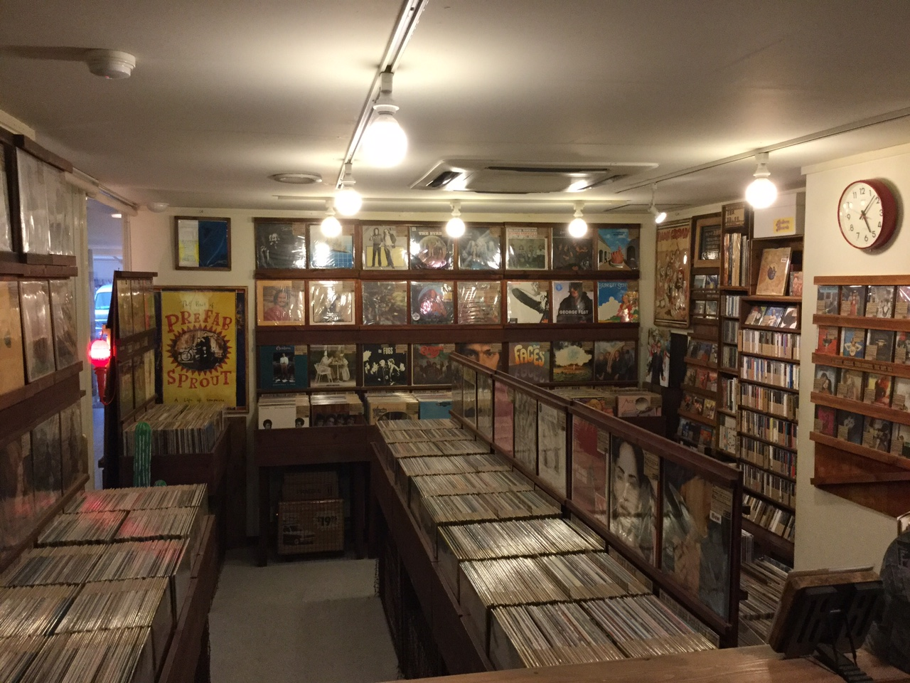

# Japan Record Map 2017

## Tokyo (東京都)

### Shinjuku (新宿区)

### Shibuya (渋谷区)

### Disk Union (ディスクユニオン)

Name | Hours | Address
---- | ----- | ----- 
[SHINJUKU ROCK RECORD STORE](http://diskunion.net/shop/ct/shinjuku_rockrecord) | 11:00-21:00 (Sunday/Holiday -20:00) | Shimogiku Bldg. 4F/5F, 3-34-12 Shinjuku Shinjuku-ku, Tokyo 160-0022
[SHINJUKU JAPANESE ROCK/INDIES STORE(BF)](http://diskunion.net/shop/ct/shinjuku_jp) |11:00-21:00 (Sunday/Holiday -20:00) | Yamada Bldg. BF, 3-31-4 Shinjuku Shinjuku-ku, Tokyo 160-0022
[SHINJUKU ROCK CD STORE(1F)](http://diskunion.net/shop/ct/shinjuku_rock) | 11:00-21:00 (Sunday/Holiday -20:00) | Yamada Bldg. 1F, 3-31-4 Shinjuku, Shinjuku-ku, Tokyo 160-0022
[SHINJUKU CD・RECORD ACCESSORY STORE(2F)](http://diskunion.net/shop/ct/shinjuku_acc) | 11:00-21:00 (Sunday/Holiday -20:00) | Yamada Bldg. 2F, 3-31-4 Shinjuku, Shinjuku-ku, Tokyo 160-0022
[SHINJUKU PROGRESSIVE ROCK STORE(3F)](http://diskunion.net/shop/ct/shinjuku_progre) | 11:00-21:00 (Sunday/Holiday -20:00) | Yamada Bldg. 3F, 3-31-4 Shinjuku, Shinjuku-ku, Tokyo 160-0022
[SHINJUKU LATIN・BRAZIL STORE(4F)](http://diskunion.net/shop/ct/shinjuku_latin) | 11:00-21:00 (Sunday/Holiday -20:00) | Yamada Bldg. 4F, 3-31-4 Shinjuku, Shinjuku-ku, Tokyo 160-0022
[SHINJUKU USED ROCK CD STORE(5F)](http://diskunion.net/shop/ct/shinjuku_usedrockcd) | 11:00-21:00 (Sunday/Holiday -20:00) | Yamada Bldg. 5F, 3-31-4 Shinjuku, Shinjuku-ku, Tokyo 160-0022
[SHINJUKU INDIE・ALTERNATIVE ROCK STORE(6F)](http://diskunion.net/shop/ct/shinjuku_alternative) | 11:00-21:00 (Sunday/Holiday -20:00) | Yamada Bldg. 6F, 3-31-4 Shinjuku, Shinjuku-ku, Tokyo 160-0022
[SHINJUKU PUNK STORE(7F)](http://diskunion.net/shop/ct/shinjuku_punk) | 11:00-21:00 (Sunday/Holiday -20:00) | Yamada Bldg. 7F, 3-31-4 Shinjuku, Shinjuku-ku, Tokyo 160-0022
[SHINJUKU USED STORE](http://diskunion.net/shop/ct/shinjuku_used) | 11:00-21:00 (Sunday/Holiday -20:00) | Kawase Bldg. 3F, 3-17-5 Shinjuku, Shinjuku-ku, Tokyo 160-0022
[SHINJUKU JAZZ STORE](http://diskunion.net/shop/ct/shinjuku_jazz) | 11:00-21:00 (Sunday/Holiday -20:00) | 3-31-2 Shinjuku, Shinjuku-ku, Tokyo 160-0022
[SHINJUKU CLASSICAL MUSIC STORE](http://diskunion.net/shop/ct/shinjuku_classic) | 11:00-21:00 (Sunday/Holiday -20:00) | Kawase Bldg. 8F, 3-17-5 Shinjuku, Shinjuku-ku, Tokyo 160-0022
[SHINJUKU SOUL/BLUES STORE](http://diskunion.net/shop/ct/shinjuku_soul) | 11:00-21:00 (Sunday/Holiday -20:00) | Fukumoto Bldg. BF, 3-28-2 Shinjuku, Shinjuku-ku, Tokyo 160-0022
[SHINJUKU HIPHOP/DANCE MUSIC STORE](http://diskunion.net/shop/ct/shinjuku_club) | 11:00-21:00 (Sunday/Holiday -20:00) | Fukumoto Bldg. 3F, 3-28-2 Shinjuku, Shinjuku-ku, Tokyo 160-0022
[SHINJUKU HEAVY METAL STORE](http://diskunion.net/shop/ct/shinjuku_metal) | 11:00-21:00 (Sunday/Holiday -20:00) | Mitsumine Bldg. 5F, 3-28-4 Shinjuku, Shinjuku-ku, Tokyo 160-0022
[SHINJUKU CINEMA STORE](http://diskunion.net/shop/ct/shinjuku_movie) | 11:00-21:00 (Sunday/Holiday -20:00) | Mitsumine Bldg. 3F, 3-28-4 Shinjuku, Shinjuku-ku, Tokyo 160-0022
[OCHANOMIZU EKIMAE STORE](http://diskunion.net/shop/ct/ocha_ekimae) | 11:00-21:00 (Sunday/Holiday -20:00) | Shin-Ochanomizu Bldg. 2F, 4-3 Kanda Surugadai, Chiyoda-ku, Tokyo 101-0062
[JazzTOKYO STORE](http://diskunion.net/shop/ct/jazz_tokyo) | 11:00-21:00 (Sunday/Holiday -20:00) | [New Surugadai Bldg. 2F, 2-1-45 Kanda Surugadai, Chiyoda-ku, Tokyo 101-0062](https://goo.gl/maps/fqJRCN3nMbL2)
[OCHANOMIZU SOUL/RARE GROOVE STORE](http://diskunion.net/shop/ct/ocha_soul) | 11:00-21:00 (Sunday/Holiday -20:00) | New Surugadai Bldg. 2F, 2-1-45 Kanda Surugadai, Chiyoda-ku, Tokyo 101-0062
[OCHANOMIZU HARD ROCK/HEAVY METAL STORE](http://diskunion.net/shop/ct/ocha_metal) | 11:00-21:00 (Sunday/Holiday -20:00) | Akanetubo Bldg., 2-6-10 Kanda Surugadai, Chiyoda-ku, Tokyo 101-0062
[SHIBUYA USED STORE](http://diskunion.net/shop/ct/shibuya_used) | 11:00-21:00 (Sunday/Holiday -20:00) | Antena21 Bldg. 2F/3F, 30-7 Udagawa-cho, Shibuya-ku, Tokyo 150-0042
[SHIBUYA JAZZ/RARE GROOVE STORE](http://diskunion.net/shop/ct/shibuya_jazz) | 11:00-21:00 (Sunday/Holiday -20:00) | Antena21 Bldg. BF, 30-7 Udagawa-cho, Shibuya-ku, Tokyo 150-0042

Name | Area | Genres | Hours | Address | Comments
---- | ----- | ------ | ----- | ------ | -----
[Jazz TOKYO](http://blog-ocha-soul.diskunion.net/) | Ochanomizu, Tokyo | Soul, Rare Groove | 11:00 ~ 21:00 (Sunday/Holiday 20:00) | [〒101-0062 東京都千代田区Kanda Surugadai, 2 Chome, 神田駿河台２丁目１−４５-2F](https://www.google.com/maps/place/Disk+Union/@35.6984038,139.7628927,17z/data=!4m5!3m4!1s0x0:0x7d19a524bd5f1a23!8m2!3d35.698944!4d139.762603?hl=en-US) | [Odigo](https://www.odigo.jp/spots/10954-disk-union-jazz-tokyo-chiyoda-ku) Best Jazz store in Tokyo
[Osaka Store](http://diskunion.net/shop/ct/osaka) | Osaka | All | 11:00 ~ 21:00 (Sunday/Holiday 20:00) | ACTIII Bldg. 1F, 15-17 Douzan-cho Kitaku Osaka-shi, Osaka 530-0027

### The Rest

Name | Area | Genres | Opening Hours | Address
---- | ---- | ------ | ------------- | -------
[Shame Records](http://www.shamerecords.main.jp) | Shinjuku | R&B, Soul, Funk, Disco, Hip Hop | 15:00 ~ 21:00 | 〒160-0023 東京都新宿区西新宿7-16-15第一歯朶ビル4F-A
[Hal's](http://hals-jazz.com) | Shinjuku | Jazz, Brazil | 12:00 ~ 21:00 | 〒160-0023 東京都新宿区西新宿7丁目10-17 新宿ダイカンプラザ　B館　306号
[The Perfect Circle Beatles](http://www.perfectcirclebeatles.jp) | Shinjuku | Beatles | 12:00 ~ 21:00 | 〒160-0023 東京都新宿区西新宿7-10-17ダイカンプラザB館507
[Coconuts Disk](http://www.coconutsdisk.com) | Yoyogi | All | 12:00 ~ 21:00 | 〒151-0053 渋谷区代々木1-36-6
[East Record](http://www.eastrecord.com) | Chiyoda | Soul, Funk, Disco, Rare Groove, Jazz, World Music | 14:00 ~ 22:00 (Monday Closed) | 〒101-0051 神田神保町1-12シマダビル4F

## Kyoto (京都)

[Google Maps](https://drive.google.com/open?id=1_M3OVkB5mrUH73TzZ-gLK3c9TFw&usp=sharing)

Name | Area | Genres | Hours | Address | Comments | Photos
---- | ---- | ------ | ----- | ------- | -------- | ------
[Llamalabo Record](http://llamalabo-pro.jp) | ? | ? | 12:00 ~ 21:00 | [14-1 Tanaka Nishiokubocho, Sakyo Ward, Kyoto, Kyoto Prefecture 606-8211, Japan](https://goo.gl/maps/XByGt6Wb9uj)
[Meditations](http://www.meditations-jp) | ? | ? | 12:00 ~ 20:00 | [Japan, 〒602-0862 Kyōto-fu, Kyōto-shi, Kamigyō-ku, Demizuchō, 253, 春日ビル 3F](https://goo.gl/maps/FQmTMJLjHjF2) | Records, CDs, and cassettes of psychedelic and drone music and Indian music
[Pooh Yokocho](http://poohyokocho.com) | ? | ? | 11:00 ~ 19:00 | [〒604-0941 Kyōto-fu, Kyōto-shi, Nakagyō-ku, Kameyachō (Gokomachidōri), 370−1](https://goo.gl/maps/omfdzZSKsSR2)
Prototype Records | ? | ? | 13:00 ~ 21:00 | [〒604-8095, 340-1 Daimonjichō (Gokomachidōri), Nakagyō-ku, Kyōto-shi, Kyōto-fu 604-8095, Japan](https://goo.gl/maps/2jo9WaTdymL2) | | 
[Art Rock No. 1](http://www.artrock-1.com) | ? | ? | 12:00 ~ 21:00 | [Japan, 〒604-8075 Kyōto-fu, Kyōto-shi, Nakagyō-ku, Shirakabechō, 中京区麩屋町通三条下ル白壁町442 FSSビル4F](https://goo.gl/maps/eNXfEorEXkE2) | | 
[Joe's Garage (ジョーズ・ガレージ)](http://www,jgarage.com) | ? | ? | 12:00 ~ 22:00 | [Japan, 〒604-8124 京都府京都市中京区高倉通錦小路下る帯屋町572](https://goo.gl/maps/g9MB124cLr82)
[L Committee Records](http://l-committee.shop-pro.jp/) | ? | ? | 12:00 ~ 19:00 | [〒604-0931 Kyoto-ku Kyoto-shi, Nakamachi-cho, Nakamachi-machi, Enji-machi 92-8 2F](https://goo.gl/maps/A1KKib3mCtT2) | | 
[Roman Shouten](http://romanshouten.blog.fc2.com) | ? | ? | 13:00 ~ 21:00 | [グラン タック 東山 二条 203, 280-2 Ishiharacho, Sakyo Ward, Kyoto, Kyoto Prefecture 606-8356, Japan](https://goo.gl/maps/cQ8TWZqqNVG2)
[Hard Bop (ハード・バップ)](http://nttbj.itp.ne.jp) | ? | Jazz | 12:30 ~ 19:00 | [Japan, 〒604-0925 京都府京都市中京区寺町通御池上る上本能寺前町474](https://goo.gl/maps/pS5qFSQmBQr) | | 
[Japonica Music Store](http://www.japonica-music.com/) | ? | Club Music | 13:00 ~ 21:00 | [Japan, 〒604-0925 Kyoto Prefecture, Kyoto, Nakagyo Ward, Kamihonnojimaecho, 476](https://goo.gl/maps/zwDvNJ5JtpD2)
[Hotline Kyoto](http://www.hotline-kyoto.com) | ? | ? | 12:30 ~ 20:00 | [〒604-0925 Kyōto-fu, Kyōto-shi, Nakagyō-ku, Kamihonnōjimaechō, 484](https://goo.gl/maps/53kUSbAZyX72) | | 
[Vinyl7 Records](http://www.vinyl7.net) | ? | Hip Hop / R&B / Dance | 13:00 ~ 20:30 | [〒604-8091, 492 Shimohonnōjimaechō, Nakagyō-ku, Kyōto-shi, Kyōto-fu 604-8091, Japan](https://goo.gl/maps/PY159sbyNc32) | | 
[Jet Set Records](http://www.jetsetrecords.net) | ? | ? | 13:00 ~ 21:00 | [Japan, 〒604-8006 Kyōto-fu, Kyōto-shi, Nakagyō-ku, Shimomaruyachō (Kawaramachidōri), 京都府京都市 中京区下丸屋町410番地 ユニティー河原町ビル6F](https://goo.gl/maps/AT8DtG2DkzL2) | | 
Workshop Records (ワークショップレコード) | ? | ? | 13:00 ~ 21:00 | [Japan, 〒604-0925 京都府京都市中京区 上本能寺前町４８５ モーリスビル 3F](https://goo.gl/maps/t9Wj58EY5pC2) | | 
[Happy Jack (ハッピージャック)](http://www.happyj.net) | ? | ? | 12:00 ~ 20:00 | [224 Eirakuchō, Nakagyō-ku, Kyōto-shi, Kyōto-fu 604-8071, Japan](https://goo.gl/maps/TpvQsKvaJm62) | | 
[Poco A Poco](http://pocoapocokyoto.com) | ? | ? | 11:00 ~ 20:00 | [Japan, 〒604-8071 Kyōto-fu, Kyōto-shi, Nakagyō-ku, Eirakuchō, 寺町通三条下る永楽町232ダイシンビルB1F](https://goo.gl/maps/EoWB13XbB9k) | | 
[Toradra Record (トラドラレコード)](http://www.toradra-record.com) | ? | ? | 12:00 ~ 20:00 | [Japan, 〒604-8034 Kyoto Prefecture, Kyoto, Nakagyo Ward, Matsugaecho, 456−6, YOGIビル3F](https://goo.gl/maps/NGdPSYznh4x) | | 
[Super Milk](http://www.super-milk.com) | ? | Black | 12:00 ~ 20:00 | [Japan, 〒604-8047 Kyōto-fu, Kyōto-shi, Nakagyō-ku, Nakasujichō, 京都府京都市 中京区新京極通蛸薬師上る中筋町495−2](https://goo.gl/maps/ruxUY4iKYjC2) | | 
[Take-J](http://kansai.me/take-j) | ? | ? | 11:15 ~ 19:30 | [Japan, 〒604-8042 Kyōto-fu, Kyōto-shi, Nakagyō-ku, Nakanochō (Shinkyōgokudōri), 中京区新京極通四条上る中之町563](https://goo.gl/maps/Q2adij1e6892) | | 

## Osaka (大阪)

[Google Map](https://drive.google.com/open?id=1ueyS2wIjatmwSz1ncfaHLNw2U7A&usp=sharing)

### Umeda (梅田)

Osaka's northernmost entrance, Umeda · Osaka. The area is greatly located between the Osaka station front building (commercial building in the business district) and Hankyu Umeda station - Nakazaki town. In Toyama and Nakazaki-machi there are new clothes shops, cafés, book stores, and new stores are also appearing at record shops.

Name | Genres | Hours | Address | Comments | Photos
---- | ------ | ----- | ------- | -------- | ------
[Disk Union](http://diskunion.net/shop/ct/osaka) | All | 11:00 ~ 21:00 | [ACTIII Bldg. 1F, 15-17 Douzan-cho Kitaku Osaka-shi, Osaka 530-0027](https://goo.gl/maps/x1QpasLuhk62) | ? | 
[Straight Records (ストレイト・レコーズ)](http://www.straight-records.jp) | SP | 12:00 ~ 20:00 | [〒 530-0026 Osaka-shi Kita Ward, Kamiyama 8-22 Meisho Building 4F](https://goo.gl/maps/UYmjScY95Cu)
[Jazz Records Seeed](http://www.seeed.net) | Jazz | 13:00 ~ 20:00 | [Japan, 〒530-0027 大阪府大阪市北区堂山町 14番29号 鈴木ビル202号](https://goo.gl/maps/B2zYPGMBXgt) | Tiny shop. | <iframe width="250" height="140" src="https://www.youtube.com/embed/uXAY6qdubzA?rel=0" frameborder="0" allowfullscreen></iframe>
Smile Record | ? | 11:00 ~ 20:00 | [Japan, 〒530-0026 Osaka Prefecture, Osaka, 北区神山町７−５ 村山ビル 1F](https://goo.gl/maps/QWnLdG3YjVz)
[Bamboo Music](http://bamboo-music.net) | Jazz, Funk, Soul, Rare Groove | 12:00 ~ 20:00 | [Japan, 〒530-0028 Osaka Prefecture, Osaka, Kita Ward, Banzaicho, 3−41, シロノビル104号室](https://goo.gl/maps/GNPDYVDjB132) | ? | 
[Disc J.J. Umeda](http://www.discjj.com) | ? | 11:00 ~ 20:00 | [Japan, 〒530-0001 Osaka Prefecture, Osaka, Kita Ward, Umeda, 1−1−3](https://goo.gl/maps/sujPaVsNDc52) | ? | 
[Music Inn](http://music-inn.jimdo.com) | All | 11:00 ~ 20:00 | [Japan, 〒530-0017 Osaka Prefecture, Osaka, Kita Ward, Kakudacho, 1−10, くろふねビル 2F](https://goo.gl/maps/L3H4kDsoGfy) | Recommended by The Vinyl Guide | 
[K-West Records](https://www.facebook.com/K-West-Records-439907216083238/) | ? | 12:00 ~ 21:00 | [Japan, 〒530-0017 Osaka Prefecture, Osaka, 北区角田町１−１０ くろふねビル2F](https://goo.gl/maps/jLUYTTV7PoE2) | Common stuff at good prices. |
[King Kong Umeda]() | ? | 11:00 ~ 23:00 | [1 Chome-9-20 Umeda, Kita-ku, Ōsaka-shi, Ōsaka-fu 530-0001, Japan](https://goo.gl/maps/JziH8cfa5Vt) | Small shop, the other King Kong is bigger. | 

### Shinsaibashi / Amerikamura (心斎橋・アメ村)

Play area where young people gather, Shinsaibashi, Ame-mura, Horie area. There are many record shops in Ame-mura, stores with various features are densely populated, but many shops with unique taste can not be missed in the shops where there is a tight shop in the alley of the business district which is a little off the area.

Name | Genres | Hours | Address | Comments | Photos
---- | ------ | ----- | ------- | -------- | ------
[Groovenut Records](http://www.groovenutrecords.net) | Soul / Funk / Jazz / Disco | 13:00 ~ 21:00 |[Japan, 〒542-0086 Ōsaka-fu, Ōsaka-shi, Chūō-ku, Nishishinsaibashi, 2 Chome−17−13, 新すみやビル201](https://goo.gl/maps/LHScuzW9e3u) | | 
[Newtone Records](http://www.newtone-records.com) | Dance | 13:00 ~ 22:00 | [Japan, 〒542-0086 Ōsaka-fu, 大阪市中央区Chūō-ku, Nishishinsaibashi, 1 Chome−10, 西心斎橋１丁目１０−３３ 北炭屋ビル2F](https://goo.gl/maps/X7MiqoJHXJq) | | 
[Flake Records](http://www.flakerecords.com) | Indie | 12:00 ~ 21:00 | [Japan, 〒5500015 大阪府大阪市西区南堀江Nishi-ku, Minamihorie, 1 Chome−11, 1-11-9 SONO四ツ橋ビル201](https://goo.gl/maps/rfBvwAzfikz) | | 
[Time Bomb Records](http://www.timebomb.jp) | ? | 12:00 ~ 21:00 | [2 Chome-9-28 Nishishinsaibashi, Chūō-ku, Ōsaka-shi, Ōsaka-fu 542-0086, Japan](https://goo.gl/maps/fyZBSk7VdTv) | | 
[Grindrecords](http://www.grindrecord.com) | Drum 'N' Bass | 14:00 ~ 24:00 | [〒542-0086 Ōsaka-fu, Ōsaka-shi, Chūō-ku, Nishishinsaibashi, 2 Chome−13−13](https://goo.gl/maps/ajLkqseYHup)
[King Kong](http://www.kingkong-music.com) | ? | 11:00 ~ 21:00 | [Japan, 〒542-0086 Ōsaka-fu, Ōsaka-shi, Chūō-ku, Nishishinsaibashi, 2 Chome−9, 中央区西心斎橋 2-9-28](https://goo.gl/maps/XcH1J3n3svG2) | | 
[Drum & Bass Records](http://www.drumandbass-rec.com) | ? | 13:00 ~ 22:00 | [Japan, 〒556-0022 Ōsaka-fu, Ōsaka-shi, Naniwa-ku, Sakuragawa, 1 Chome−１−７−３０ リバーライズビル](https://goo.gl/maps/yHNNgmVnwSL2)
[Rare Groove](http://www.raregroove.jp) | Rare Groove | 12:00 ~ 20:00 | [1-9-28-202 Chuou-ku -Nishi-Shinsaibashi,, 1 Chome-9 Nishishinsaibashi, Chūō-ku, 中央区 大阪市, Osaka 5420086, Japan](https://goo.gl/maps/SfPEZedLDu52) | | 
[Plantation](http://plantationwebshop.com) | Asian | 15:00 ~ 20:00 | [1 Chome-9-28 Nishishinsaibashi, Chūō-ku, Ōsaka-shi, Ōsaka-fu 542-0086, Japan 3F](https://goo.gl/maps/YDBozm4ntKK2) | | 
[Old Hat Gear](http://oldhatgear.com) | 50's, 60's | 12:00 ~ 20:00 | [1 Chome-9-28 Nishishinsaibashi, Chūō-ku, Ōsaka-shi, Ōsaka-fu 542-0086, Japan](https://goo.gl/maps/xwrcq6aLDTC2) | | 
[The Melody](http://home.att.ne.jp/blue/mel) | Aor / Westcoast / Hawaii | 16:00 ~ 01:00 | [〒542-0083 Ōsaka-fu, Ōsaka-shi, Chūō-ku, Higashishinsaibashi, 1 Chome−14 2F](https://goo.gl/maps/MuxYVFBLcgK2)
[Night Beat Records (ナイトビートレコード)](http://www.nightbeatrecords.com) | 50's / 60's | 10:00 ~ 19:00 | [Japan, 〒542-0086 Osaka Prefecture, Osaka, Chuo Ward, Nishishinsaibashi, 1 Chome−9−28, リーストラクチャー西心斎橋207](https://goo.gl/maps/696ySE7YQY12) | | 
[Vinyl Chamber](http://www.vinylchamber.com) | Soul, Jazz, Funk, Rare Groove, Latin | 12:00 ~ 20:00 | [1 Chome-9-28 Nishishinsaibashi, Chūō-ku, Ōsaka-shi, Ōsaka-fu 542-0086, Japan](https://goo.gl/maps/NLHdy7iM9bL2) | | 
[Voxmusic](http://www.vosmusicweb.com) | Black | 12:00 ~ 20:00 | [Japan, 〒542-0086 大阪府大阪市中央区Chūō-ku, Nishishinsaibashi, 1 Chome−4, 西心斎橋１丁目４−１７ シゲタニビル2F](https://goo.gl/maps/EDvZfES1Wy12) | | 
[Root Down Records](http://www.rootdownrecords.jp) | Soul / Funk / Jazz | 13:00 ~ 22:00 | [Japan, 〒542-0086 Ōsaka-fu, Ōsaka-shi, Chūō-ku, Nishishinsaibashi, 1 Chome−10−33, 北炭屋ビル 5F](https://goo.gl/maps/mYY3G6scNSM2) | | 
[Afro Juice](http://www.afro-juice.com) | Black | 12:00 ~ 20:00 (Closed Wed)| [〒542-0086, 1 Chome-10-33 Nishishinsaibashi, Chūō-ku, Ōsaka-shi, Ōsaka-fu 542-0086, Japan](https://goo.gl/maps/RpmoumXoxKG2)
[Redbone Records](http://redbonerecords.o.oo7.jp/) | All | 12:30 ~ 20:00 | [3 Chome-3-26 Minamisenba, Chuo Ward, Osaka, Osaka Prefecture 542-0081, Japan](https://goo.gl/maps/kZP8cmtg1oK2) | Stereolab, Strangelove, Cast, and Boo Radleys.| 
[Drella Record](http://drellarecord.com) | A | 12:00 ~ 20:00 | [Japan, 〒550-0013 大阪府大阪市西区新町Nishi-ku, Shinmachi, 1 Chome−22, 1-22-20第2中村興産ビル102号](https://goo.gl/maps/N4BC914CAPR2) |  | 
[Blue Soul Records](http://bluesoulrecords.jp) | Black | 12:00 ~ 20:00 | [Japan, 〒542-0081 大阪府大阪市中央区南船場4-10-25Chūō-ku, Minamisenba, 4 Chome−10, 第3飯沼ビル6階](https://goo.gl/maps/duaEjXShNdU2) | Black music specialized second-hand record shop | 
[Revelation Time](http://revelationtime.net) | A | 13:00 ~ 20:00 | [Japan, 〒542-0081 Ōsaka-fu, Ōsaka-shi, Chūō-ku, Minamisenba, 4 Chome−9, 中央区 南船場4丁目９－５ NOAビル 4F-A号](https://goo.gl/maps/JK9mhdaLagr) | | 
[Especial Records](http://www.especial-records.com) | Jazz, Club Music | 12:00 ~ 20:00 | [Japan, 〒542-0081 Ōsaka-fu, Ōsaka-shi, Chūō-ku, Minamisenba, 4 Chome−9, 9- 第２有樹ビル](https://goo.gl/maps/RJcHLMDNUQ82)
[Panpot Records](http://panpotrecords.com) | A | 13:00 ~ 20:00 | [Japan, 〒542-0081 Osaka Prefecture, Osaka, 中央区南船場4-3-21](https://goo.gl/maps/EH5H2AA23vC2)
[Maru Ka Batsu](http://www.ox-z.com) | ? | 12:00 ~ 21:00 | [1 Chome-5-2 Kitahorie, Nishi Ward, Osaka, Osaka Prefecture 550-0014, Japan](https://goo.gl/maps/Kd1DqULZ2cz) | | 
[Rocker's Island](http://www.rockers-island.com) | Reggae | 11:00 ~ 21:30 | [Japan, 〒550-0014 Osaka Prefecture, Osaka, Nishi Ward, Kitahorie, 1−2−17](https://goo.gl/maps/NZPVj9FsLL32)
[Waxpend Records](http://www.waxpend.com) | ? | 11:00 ~ 18:00 | [1 Chome-11-5 Kitahorie, Nishi-ku, Ōsaka-shi, Ōsaka-fu 550-0014, Japan](https://goo.gl/maps/X9p38GGsn9s) | | 
[Morpho Records](http://www.morphorecords.com) | R&B | 12:00 ~ 21:00 | [Japan, 〒542-0086 Ōsaka-fu, Ōsaka-shi, Chūō-ku, Nishishinsaibashi, 1 Chome−9−28, ２０９ リーストラクチャー西心斎橋ウエスト](https://goo.gl/maps/AsX2GyP3Jgx) | | 
[Perfect Pitch Records](http://www.perfectpitchrecords.com) | Disco / Hip-Hop | 12:00 ~ 20:00 | [〒542-0086 Ōsaka-fu, Ōsaka-shi, Chūō-ku, Nishishinsaibashi, 1 Chome−4−17 2F](https://goo.gl/maps/kQTWTT6YDBn)

### Namba / Nihonbashi (難波・日本橋)

Next to Namba, the Nihonbashi area is an electric and geeky town like Tokyo's Akihabara. Record shops are gathering miscellaneously from shops that have multiple stores to stores like new sect shops.

Name | Genres | Hours | Address | Comments | Photos
---- | ------ | ----- | ------- | -------- | ------
[Sound Pak Nipponbashi](http://soundpak4.sakura.ne.jp) | ? | 11:00 ~ 20:00 | [4 Chome-16-11 Nipponbashi, Naniwa-ku, Ōsaka-shi, Ōsaka-fu 556-0005, Japan](https://goo.gl/maps/Q4KrhBZK15U2) | | 
[Carib Records](http://caribrecords.com) | ? | 14:00 ~ 20:00 | [2 Chome-8-71 Nanbanaka, Naniwa-ku, Ōsaka-shi, Ōsaka-fu 556-0011, Japan](https://goo.gl/maps/Deu43s7vy682) | | 
[Disc J.J. Nipponbashi](http://www.discjj.com) | Jazz, Soul, Rock | 11:00 ~ 20:00 (Thu/Hol 19:00) | [〒556-0005, 4 Chome-8-11 Nipponbashi, Naniwa Ward, Osaka, Osaka Prefecture, Japan](https://goo.gl/maps/EnWjVsfZNvt) | Stereolab "Dots and Loops" and High Llamas "Lollo Rosso" | 
[Rubic Records](http://rubic-records.com) | Jazz / Funk / Soul | 12:00 ~ 20:00 | [Japan, 〒556-0004 大阪府大阪市浪速区Naniwa-ku, Nipponbashinishi, 1 Chome−2, 日本橋西１丁目２−１０ 難波９４ＮＮビル３Ｆ](https://goo.gl/maps/43JbLT5CLJy) | | 
[Sound Pak](http://soundpak.web.fc2.com) | ? | 11:00 ~ 20:00 | [Japan, 〒556-0011 Ōsaka-fu, Ōsaka-shi, Naniwa-ku, Nanbanaka, 2 Chome−4, 村上ビル](https://goo.gl/maps/BZi41GkskRv) | | 
[Wild One (ワイルドワン)](http://wildone.la.coocan.jp/) | ? | 12:00 ~ 20:00 | [Japan, 〒556-0011 大阪府大阪市浪速区Naniwa-ku, Nanbanaka, 2 Chome−4, 難波中２丁目４−３ 村上ビル 306 (3F)](https://goo.gl/maps/BufaxV54MGx) | | 
[Naka Second](http://nakasecond.livedoor.biz) | | 11:00 ~ 20:00 | [Japan, 〒556-0011 Osaka Prefecture, Osaka, 浪速区難波中２丁目６−１](https://goo.gl/maps/fqZvzV94x9L2)
[Mint Record](http://mintrecord.com) | ? | 11:00 ~ 20:00 | [8-12 Nanbasennichimae, Chūō-ku, Ōsaka-shi, Ōsaka-fu 542-0075, Japan](https://goo.gl/maps/qxhs8mGpLqy) | | 
[Mint Record 2](http://mintrecord.jugem.jp) | ? | 11:00 ~ 20:00 | [5 Chome-9-13 Nipponbashi, Naniwa-ku, Ōsaka-shi, Ōsaka-fu 556-0005, Japan](https://goo.gl/maps/sMwUpHBWRFP2) | | 
[S. A. Music](http://www.metalpesado.com) | Heavy Metal | 11:00 ~ 20:00 | [1 Chome-1-14 Nipponbashinishi, Naniwa-ku, Ōsaka-shi, Ōsaka-fu 556-0004, Japan](https://goo.gl/maps/po8W8j3teCR2) | | 
[Merry Nice](http://www33.ocn.ne.jp) | J-Pop | 12:30 ~ 20:00 | [4 Chome-17-21 Nipponbashi, Naniwa-ku, Ōsaka-shi, Ōsaka-fu 556-0005, Japan](https://goo.gl/maps/SpZWGiakX5C2)

### Other

Name | Genres | Hours | Address | Comments | Photos
---- | ------ | ----- | ------- | -------- | ------
[Bear's Choice](http://www.bearschoice.com) | Grateful Dead | 11:00 ~ 18:00 | [Japan, 〒545-0053 Ōsaka-fu, Ōsaka-shi, Abeno-ku, Matsuzakichō, 3 Chome−9, 阿倍野区松崎町3-9-31](https://goo.gl/maps/GcwsxXu6XfT2) | | 
[Smile Record 2](http://www.used-record.com) | ? | 10:00 ~ 18:00 | [2 Chome-7-5 Tsuruhashi Ikuno-ku, Ōsaka-shi, Ōsaka-fu 544-0031, Japan](https://goo.gl/maps/sJC8WEJy1R42)
[Kinky's](http://www.kinkys.jp) | 60's | 13:00 ~ 19:00 | [Japan 〒572-0838 Ōsaka-fu, Neyagawa-shi, Yasakachō, 25−5](https://goo.gl/maps/gDo3E445ohq) | 
[Kong Land (コング八戸ノ里店CDゲームショップ)](http://kongland.xyz) | ? | 12:00 ~ 21:00 | [Japan, 〒577-0801 大阪府東大阪市小阪２丁目１３−２１](https://goo.gl/maps/357fKgj6Dhv) | 90% CDs. Also games. | 
[Books Channel](http://booksch.com) | ? | 10:00 ~ 20:00 | [1 Chome-7-20 Yamamotochōminami, Yao-shi, Ōsaka-fu 581-0013, Japan](https://goo.gl/maps/PvT9Ta2c68m) | | 
[Chico Records](http://chicoreco.web.fc2.com) | ? | 13:00 ~ 19:00 |
[Sam's Records Shop (サムズ・レコード・ショップ堺店)](http://www.sams-record.com) | Black | 11:00 ~ 20:00 | [〒590-0021 Ōsaka-fu, Sakai-shi, Sakai-ku, Kitamikunigaokachō, ７丁4−19](https://goo.gl/maps/yaNWNEyBZKo) | 50% LP / 50% CD
[Red House](http://redhouse-osaka.com) | ? | 11:00 ~ 20:00 | [〒590-0021 Ōsaka-fu, Sakai-shi, Sakai-ku, Kitamikunigaokachō, ７丁4−15](https://goo.gl/maps/JUrPMZj8kXS2)

## Useful Words

English | Japanese | Pronounciation
------- | -------- | --------------
Analog  | アナログ  | Anarogu 

## Maps

<table>
  <tr>
	<td></td>
    <td></td>
    <td></td>
  </tr>
</table>

